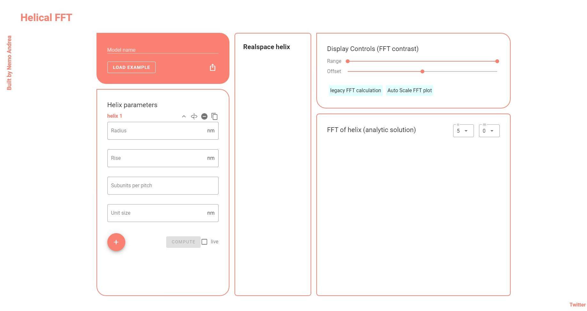

# tutorial

When you load helix-FFT, you'll be greeted with the following UI:



We can divide the UI into 5 general components. 

1. The meta panel
2. The parameter panel
3. The realspace panel
4. The Fourier display controls
5. The Fourier panel

## The meta panel

The meta panel is used for 3 things:

1. Set the name of the current model
2. Load an example (see [the example page](./examples.md) for other examples)
3. Export the current model. 

## The parameter panel

This panel is the main input panel. Here you specify the different parameters. Helix-FFT allows you to specify a 'helix-family': a collection of helices. When the page is loaded, there will be a single helix (`helix 1`) box to enter parameters. There are four parameters for the first helix:

* Radius — The radius of the helix (radius to the centre of the subunits)

* Rise — The offset between subunits along the helix axis

* Subunits per pitch — The number of subunits that fit in a pitch (a 2 pi rotation) of the helix. Need not be integer.

* Unit Size — The radius of the subunits. 

  > currently only used for the realspace plot

If you are working with multiple helices, then the helices beyond the first one will have two additional parameters:

* offset — the offset in z of the helix object relative to `helix 1`
* rotation —  the rotation in degrees of the helix relative to `helix 1`

**Navigating the parameter panel**

In the parameter panel, only **1 helix'** parameter can be unfolded at a time. Simply click the name of the helix (e.g. `helix 1`) or the arrow symbols or the space in between to expand and collapse the parameter panels. 

The expanded panels will show some extra options: [1] switching handedness [2] delete helix [3] copy helix parameters to new helix

**Adding new helices**

There are two ways to add new helices to the parameter panel: [1] Pressing the `+` icon. This will add a new empty set of helix parameters. [2] pressing the copy button on an existing helix. This will make a new set of helix parameters and copy the source's parameters into it. 

**Computing**

To compute the FFT, you simply press the `compute` button. This will then trigger calculation and display the diffraction pattern of the helix-family in the `Fourier Panel`. An alternative option is to check the tickbox labelled 'live'. This will then trigger calculation every time you change a parameter. 

>  Using the 'live' mode is recommended. If your device is very slow, you may want to leave it in the *off* state.

## The Realspace panel

This panel shows a realspace image of your helix family. It will update automatically when you change parameters (independent of whether you have 'live' mode on). The different helices are drawn in different colours. 

You can pan around the helix by holding down left-mouse button and moving the mouse. To zoom, use the mouse wheel. The helix will slowly rotate by default, but you can toggle this off and on with the dedicated button. If you want to get a better look at the helix, you can make the panel bigger with the fullscreen button.


## The Fourier display controls

This panel changes what and how the `Fourier panel` displays the diffraction pattern. 

Currently, it allows the setting of the contrast of the diffraction pattern and the ability to autoscale the FFT image based on the set `n`.

Contrast is handled via the following formula:

```
out = ( in - [range min] ) * ( [range max] - [range max] )  + [offset]
```

> Everything above [range max] will be clipped to white, while all values below [range min] will be clipped to black. 


## The Fourier panel

This panel shows the diffraction pattern (which is a cross-section of the fourier transform of the helical structure) of the helix-family. 

You can zoom using the scroll wheel, and pan around by holding down left mouse button. 

**Layer Lines**

Layer lines of the diffraction pattern are drawn only at z-positions (vertical axis in diffraction plot) that meet `z = n / pitch + m / rise`. The values `n `and `m` can take are listed below. If you wish to understand this better, I recommend the reference below.

In the panel you can set the `n` and `m` to be displayed. `n` refers to the maximum order of the layerline to be plotted for a continuous helix.

> For example for n=3, it will plot n_set = [0, 1, 2, 3]

 `m` represents the maximum order that is plotted due to the discrete sampling of the helix (i.e. a helix is made up out of subrunits, and is not continious). 

> for example, for m = 3, it will plot m_set=[-3,-2,-1,0, 1, 2, 3]

In an ideal setting `n` and `m` would be set to `infinity`, but in practice you will not have to go above 20 or so. If you have a reference pattern, and it is not reproduced by the plot, try increasing `n`and `m`, it makes the calculation take slightly longer. Sometimes it can be *instructive* to leave them at low values to get a better idea what parts of the plot are made up of which orders. 

**Literature on the diffraction pattern**

```
Harford, Jeffrey, and John Squire. "Time-resolved diffraction studies of muscle using synchrotron radiation." Reports on Progress in Physics 60.12 (1997): 1723.
```